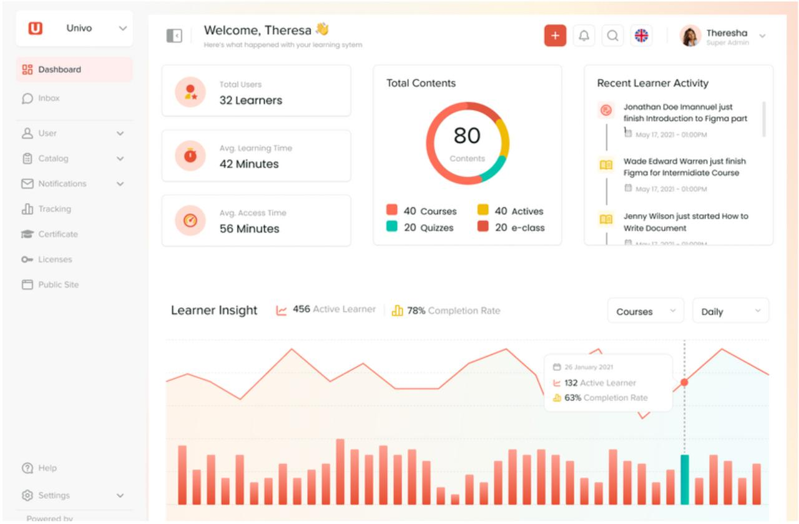
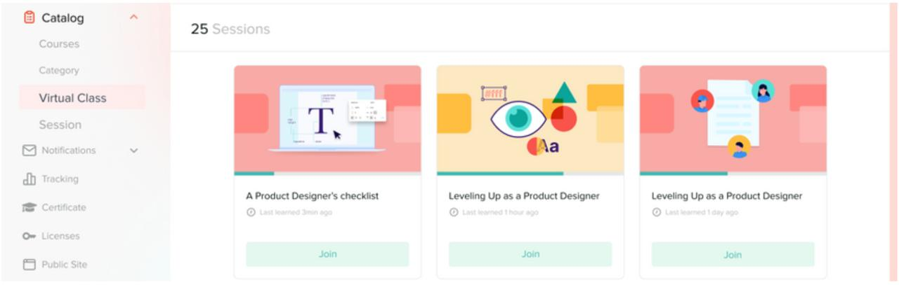

# 📚 LXS Univo

**Learning anytime, anywhere: the right content, on a platform you own.** The production-proven LMS, live in hours.

*Documentation available in English, version française en cours.*

---

## Explore the platform

<table>
  <tr>
    <td width="50%">
      <h3>🎓 Learner App</h3>
      
Fast, mobile-first React interface. Courseware player, progress tracking, certificates, coach chat, all in <code>/app</code>.

      
<a href="developer-guides/mfe-app.md">Developer guide →</a>

      
    </td>
    <td width="50%">
      <h3>🎥 Virtual Class</h3>
      
Live sessions on integrated Jitsi. Coaches host cohort video calls inside the platform, no external tool.

      
<a href="product/social-learning.md">Social learning →</a>

      
    </td>
  </tr>
  <tr>
    <td width="50%">
      <h3>🏗️ Architecture</h3>
      
React micro-frontends, GraphQL on AWS Lambda, Terraform-managed infrastructure. You own every layer.

      
<a href="architecture/system-architecture.md">System overview →</a>

    </td>
    <td width="50%">
      <h3>☁️ Live in hours</h3>
      
Repeatable delivery playbook: prerequisites, Terraform apply, platform deploy, DNS cutover, go-live checklist.

      
<a href="deployment/deployment-guide.md">Deployment guide →</a>

    </td>
  </tr>
  <tr>
    <td width="50%">
      <h3>🌱 Social Learning</h3>
      
Real-time coach chat, course comments, live sessions, community features built in, not bolted on.

      
<a href="product/social-learning.md">See features →</a>

    </td>
    <td width="50%">
      <h3>🗺️ Roadmap</h3>
      
Offline-first learning, thematic groups, learner networking, see where the platform is heading next.

      
<a href="roadmap/README.md">Public roadmap →</a>

    </td>
  </tr>
</table>

---

## Why LXS Univo?

- **Proven in production**: serving learners today, not a prototype
- **Live in hours**: a repeatable, documented delivery playbook; full enterprise rollout in 3 weeks including branding, content and training
- **Modern experience**: fast, mobile-first React interfaces (not legacy LMS UX)
- **Social learning built-in**: real-time chat, groups, peer networking
- **Offline-ready roadmap**: learning continues even with unstable connectivity
- **Your infrastructure**: deployed in YOUR AWS account, you own everything

## Platform at a glance

| Component | Technology |
|---|---|
| Learner app | React 17 SPA (micro-frontend) |
| Admin console | React 17 SPA (micro-frontend) |
| Auth service | React 17 SPA (micro-frontend) |
| Course engine | Mature open-source course engine (Studio, LMS, xBlocks, SCORM) |
| API layer | GraphQL (serverless AWS Lambda) |
| Realtime | Pusher (chat & notifications) |
| Video | Vimeo Pro + Jitsi (live sessions) |
| Infrastructure | Terraform on AWS (EC2, RDS, DocumentDB, CloudFront, WAF) |

## Documentation map

- **New here?** Start with the [Platform Overview](getting-started/platform-overview.md)
- **A client?** See [What You Get](getting-started/for-clients.md) and [Client Prerequisites](deployment/client-prerequisites.md)
- **A developer?** Jump to the [Quickstart](getting-started/quickstart.md) and [Developer Guides](developer-guides/mfe-app.md)
- **Operations?** Go to [Deployment & Runbooks](deployment/deployment-guide.md)
- **Where are we going?** Read the [Product Roadmap](roadmap/README.md)

## Clients & references

First enterprise deployment: a leading African financial institution (financial education platform for women entrepreneurs).

---

*LXS Univo is developed and maintained by Pantheon Group. For sales inquiries: contact Erik / Joel Mamihery.*
